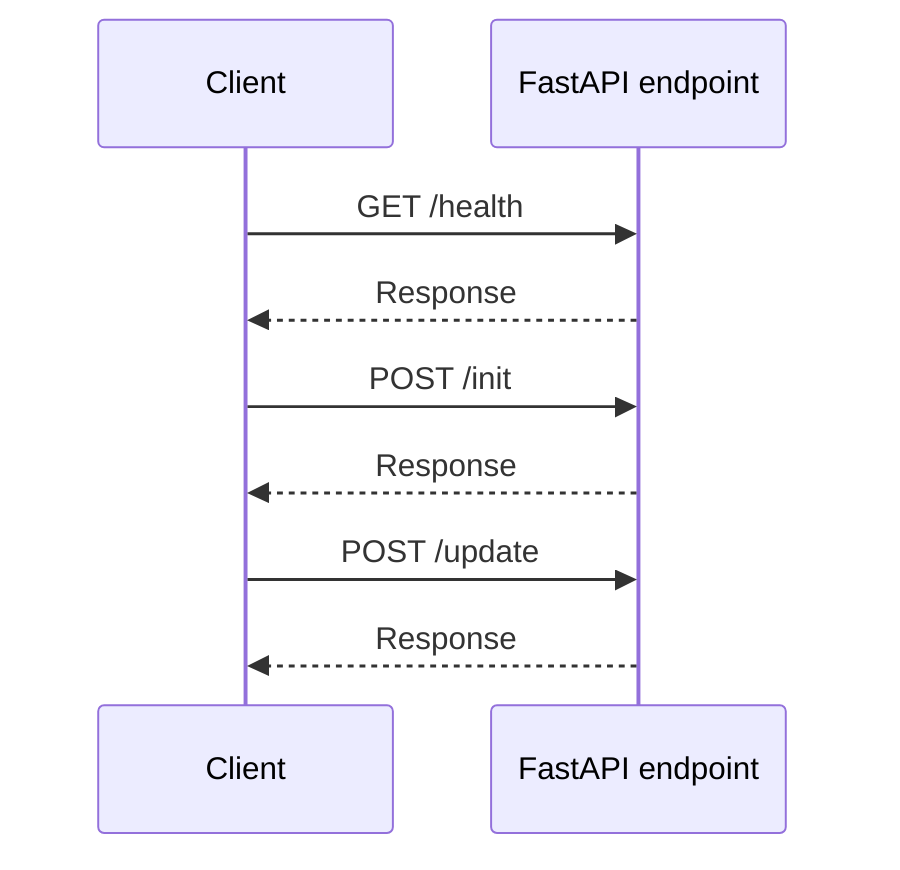

# docgen
<!-- docgen:begin:badges -->
[](#)
[](#)
[](#)
<!-- docgen:end:badges -->

<!-- docgen:begin:toc -->
## Table of Contents
- [Table of Contents](#table-of-contents)
- [Quick Start](#quick-start)
- [Configuration](#configuration)
- [Build & Test](#build-test)
- [Deployment](#deployment)
- [Troubleshooting](#troubleshooting)
- [FAQ](#faq)
- [License](#license)
<!-- docgen:end:toc -->

<!-- docgen:begin:intro -->
docgen is a Python and YAML project. This README was bootstrapped by ``docgen init`` to summarize the repository at a glance.

> Context highlights:
> name: docgen-update on: push: branches: [ main ] pull_request: branches: [ main ] jobs: update-readme: runs-on: self-hosted steps: - uses: actions/checkout@v4 with: fetch-depth: 0 - uses: actions/setup-python@v5 with: python-version: '3.11' - uses: actions/cache@v4 with: path: ~/.cache/pip key: ${{ runner.os }}-pip-${{ hashFiles('pyproject.toml') }} restore-keys: ${{ runner.os }}-pip- - name: Install dependencies run: | python -m pip install --upgrade pip python -m pip install -e .[dev] - name: Determine diff base id: diff run: | if [ "${{ github.event_name }}" = "pull_request" ]; then echo "base=${{ github.event.pull_request.base.sha }}" >> "$GITHUB_OUTPUT" else echo "base=origin/main" >> "$GITHUB_OUTPUT" fi - name: Run docgen update env: DOCGEN_LLM_BASE_URL: http://localhost:12434/engines/v1 run: python -m docgen.cli update --diff-base ${{ steps.diff.outputs.base }} - name: Commit README.md (optional) run: | if git status --short | grep -q README.md; then git config user.name "github-actions" git config user.email "github-actions@users.noreply.github.com" git commit -am "docs: update README via docgen" fi
> # GitHub Actions Integration The workflow below runs `docgen update` on pushes and pull requests. It assumes a self-hosted runner (or GitHub-hosted runner with network access to your local model runtime). The job skips early when no files match `.docgen.yml`'s `ci.watched_globs` entries so that purely documentation-only changes do not trigger the generator. ```yaml name: docgen-update on: push: branches: [ main ] pull_request: branches: [ main ] jobs: update-readme: runs-on: self-hosted # requires local LLM access steps: - name: Checkout repository uses: actions/checkout@v4 with: fetch-depth: 0 - name: Set up Python uses: actions/setup-python@v5 with: python-version: '3.11' - name: Cache pip dependencies uses: actions/cache@v4 with: path: ~/.cache/pip key: ${{ runner.os }}-pip-${{ hashFiles('pyproject.toml') }} restore-keys: ${{ runner.os }}-pip- - name: Install docgen in editable mode run: | python -m pip install --upgrade pip python -m pip install -e .[dev] - name: Determine diff base id: diff run: | if [ "${{ github.event_name }}" = "pull_request" ]; then echo "base=${{ github.event.pull_request.base.sha }}" >> "$GITHUB_OUTPUT" else echo "base=origin/main" >> "$GITHUB_OUTPUT" fi - name: Run docgen update env: DOCGEN_LLM_BASE_URL: http://localhost:12434/engines/v1 run: | python -m docgen.cli update --diff-base ${{ steps.diff.outputs.base }} - name: Commit README updates (if any) run: | if git status --short | grep -q README.md; then git config user.name "github-actions" git config user.email "github-actions@users.noreply.github.com" git commit -am "docs: update README via docgen" fi - name: Upload README artifact if: success() uses: actions/upload-artifact@v4 with: name: generated-readme path: README.md ``` > **Note:** the workflow relies on `DOCGEN_LLM_BASE_URL` pointing to a local or > private inference endpoint. For GitHub-hosted runners you will need to expose > the runner within your private network or switch to the `ollama` CLI with > appropriate caching. ```
> # docgen <!-- docgen:begin:badges --> [](#) [](#) [](#) <!-- docgen:end:badges --> <!-- docgen:begin:toc --> ## Table of Contents - [Features](#features) - [Architecture](#architecture) - [High-Level Flow](#high-level-flow) - [Component Responsibilities](#component-responsibilities) - [Artifacts and Data Stores](#artifacts-and-data-stores) - [Pipeline Sequence (`docgen init`)](#pipeline-sequence-docgen-init) - [Patch Sequence (`docgen update`)](#patch-sequence-docgen-update) - [API Signal Extraction](#api-signal-extraction) - [Quick Start](#quick-start) - [Configuration](#configuration) - [Build & Test](#build-test) - [Deployment](#deployment) - [Troubleshooting](#troubleshooting) - [FAQ](#faq) - [License](#license) <!-- docgen:end:toc --> <!-- docgen:begin:intro --> docgen is a local-first README generator for polyglot repositories. It scans every tracked file, publishes analyzer signals, retrieves grounded context, and guides a local LLM through templated sections to produce or update documentation. This overview reflects a complete pass across `docgen/`, `tests/`, `spec/`, and `docs/` so contributors understand every abstraction before running `docgen init`. <!-- docgen:end:intro --> ## Features <!-- docgen:begin:features -->
- Primary languages: Python, YAML
- Supported build tooling: generic
- Entry points: Run FastAPI application, Run FastAPI application, Run FastAPI application
- Key modules: .gitignore (1 files), AGENTS.md (1 files), README.md (1 files)
- API surface: /health, /init, /update
- Entities detected: InitRequest, InitResponse, UpdateRequest
- Ready for continuous README generation via docgen.
> Context highlights:
> name: docgen-update on: push: branches: [ main ] pull_request: branches: [ main ] jobs: update-readme: runs-on: self-hosted steps: - uses: actions/checkout@v4 with: fetch-depth: 0 - uses: actions/setup-python@v5 with: python-version: '3.11' - uses: actions/cache@v4 with: path: ~/.cache/pip key: ${{ runner.os }}-pip-${{ hashFiles('pyproject.toml') }} restore-keys: ${{ runner.os }}-pip- - name: Install dependencies run: | python -m pip install --upgrade pip python -m pip install -e .[dev] - name: Determine diff base id: diff run: | if [ "${{ github.event_name }}" = "pull_request" ]; then echo "base=${{ github.event.pull_request.base.sha }}" >> "$GITHUB_OUTPUT" else echo "base=origin/main" >> "$GITHUB_OUTPUT" fi - name: Run docgen update env: DOCGEN_LLM_BASE_URL: http://localhost:12434/engines/v1 run: python -m docgen.cli update --diff-base ${{ steps.diff.outputs.base }} - name: Commit README.md (optional) run: | if git status --short | grep -q README.md; then git config user.name "github-actions" git config user.email "github-actions@users.noreply.github.com" git commit -am "docs: update README via docgen" fi
> # GitHub Actions Integration The workflow below runs `docgen update` on pushes and pull requests. It assumes a self-hosted runner (or GitHub-hosted runner with network access to your local model runtime). The job skips early when no files match `.docgen.yml`'s `ci.watched_globs` entries so that purely documentation-only changes do not trigger the generator. ```yaml name: docgen-update on: push: branches: [ main ] pull_request: branches: [ main ] jobs: update-readme: runs-on: self-hosted # requires local LLM access steps: - name: Checkout repository uses: actions/checkout@v4 with: fetch-depth: 0 - name: Set up Python uses: actions/setup-python@v5 with: python-version: '3.11' - name: Cache pip dependencies uses: actions/cache@v4 with: path: ~/.cache/pip key: ${{ runner.os }}-pip-${{ hashFiles('pyproject.toml') }} restore-keys: ${{ runner.os }}-pip- - name: Install docgen in editable mode run: | python -m pip install --upgrade pip python -m pip install -e .[dev] - name: Determine diff base id: diff run: | if [ "${{ github.event_name }}" = "pull_request" ]; then echo "base=${{ github.event.pull_request.base.sha }}" >> "$GITHUB_OUTPUT" else echo "base=origin/main" >> "$GITHUB_OUTPUT" fi - name: Run docgen update env: DOCGEN_LLM_BASE_URL: http://localhost:12434/engines/v1 run: | python -m docgen.cli update --diff-base ${{ steps.diff.outputs.base }} - name: Commit README updates (if any) run: | if git status --short | grep -q README.md; then git config user.name "github-actions" git config user.email "github-actions@users.noreply.github.com" git commit -am "docs: update README via docgen" fi - name: Upload README artifact if: success() uses: actions/upload-artifact@v4 with: name: generated-readme path: README.md ``` > **Note:** the workflow relies on `DOCGEN_LLM_BASE_URL` pointing to a local or > private inference endpoint. For GitHub-hosted runners you will need to expose > the runner within your private network or switch to the `ollama` CLI with > appropriate caching. ```
> """Analyzer to detect executable entrypoints across supported languages.""" from __future__ import annotations import re from dataclasses import dataclass from pathlib import Path from typing import Iterable, List, Optional from .base import Analyzer from .utils import ( build_node_script_command, detect_node_package_manager, load_node_dependencies, load_package_json, ) from ..models import RepoManifest, Signal @dataclass class EntryPoint: """Represents a detected entrypoint with an associated command.""" name: str command: str label: str priority: int = 50 framework: Optional[str] = None class EntryPointAnalyzer(Analyzer): """Detect executable entrypoints for quick-start guidance.""" def supports(self, manifest: RepoManifest) -> bool: return bool(manifest.files) def analyze(self, manifest: RepoManifest) -> Iterable[Signal]: entrypoints: List[EntryPoint] = [] manifest_paths = {file.path for file in manifest.files} entrypoints.extend(self._python_entrypoints(manifest)) entrypoints.extend(self._node_entrypoints(Path(manifest.root), manifest_paths)) entrypoints.extend(self._java_entrypoints(manifest)) signals: List[Signal] = [] for entry in sorted(entrypoints, key=lambda ep: ep.priority): metadata = { "command": entry.command, "label": entry.label, "priority": entry.priority, } if entry.framework: metadata["framework"] = entry.framework signals.append( Signal( name=f"entrypoint.{entry.name}", value=entry.command, source="entrypoints", metadata=metadata, ) ) if entrypoints: primary = min(entrypoints, key=lambda ep: ep.priority) signals.append( Signal(
<!-- docgen:end:features --> ## Architecture <!-- docgen:begin:architecture -->
- `.gitignore/` - src (1 file)
- `AGENTS.md/` - docs (1 file)
- `README.md/` - docs (1 file)
- `docgen/` - src (61 files)
- `docs/` - docs (2 files)
- `spec/` - docs (5 files)
- `tests/` - test (24 files)

> Context highlights:
> name: docgen-update on: push: branches: [ main ] pull_request: branches: [ main ] jobs: update-readme: runs-on: self-hosted steps: - uses: actions/checkout@v4 with: fetch-depth: 0 - uses: actions/setup-python@v5 with: python-version: '3.11' - uses: actions/cache@v4 with: path: ~/.cache/pip key: ${{ runner.os }}-pip-${{ hashFiles('pyproject.toml') }} restore-keys: ${{ runner.os }}-pip- - name: Install dependencies run: | python -m pip install --upgrade pip python -m pip install -e .[dev] - name: Determine diff base id: diff run: | if [ "${{ github.event_name }}" = "pull_request" ]; then echo "base=${{ github.event.pull_request.base.sha }}" >> "$GITHUB_OUTPUT" else echo "base=origin/main" >> "$GITHUB_OUTPUT" fi - name: Run docgen update env: DOCGEN_LLM_BASE_URL: http://localhost:12434/engines/v1 run: python -m docgen.cli update --diff-base ${{ steps.diff.outputs.base }} - name: Commit README.md (optional) run: | if git status --short | grep -q README.md; then git config user.name "github-actions" git config user.email "github-actions@users.noreply.github.com" git commit -am "docs: update README via docgen" fi
> # GitHub Actions Integration The workflow below runs `docgen update` on pushes and pull requests. It assumes a self-hosted runner (or GitHub-hosted runner with network access to your local model runtime). The job skips early when no files match `.docgen.yml`'s `ci.watched_globs` entries so that purely documentation-only changes do not trigger the generator. ```yaml name: docgen-update on: push: branches: [ main ] pull_request: branches: [ main ] jobs: update-readme: runs-on: self-hosted # requires local LLM access steps: - name: Checkout repository uses: actions/checkout@v4 with: fetch-depth: 0 - name: Set up Python uses: actions/setup-python@v5 with: python-version: '3.11' - name: Cache pip dependencies uses: actions/cache@v4 with: path: ~/.cache/pip key: ${{ runner.os }}-pip-${{ hashFiles('pyproject.toml') }} restore-keys: ${{ runner.os }}-pip- - name: Install docgen in editable mode run: | python -m pip install --upgrade pip python -m pip install -e .[dev] - name: Determine diff base id: diff run: | if [ "${{ github.event_name }}" = "pull_request" ]; then echo "base=${{ github.event.pull_request.base.sha }}" >> "$GITHUB_OUTPUT" else echo "base=origin/main" >> "$GITHUB_OUTPUT" fi - name: Run docgen update env: DOCGEN_LLM_BASE_URL: http://localhost:12434/engines/v1 run: | python -m docgen.cli update --diff-base ${{ steps.diff.outputs.base }} - name: Commit README updates (if any) run: | if git status --short | grep -q README.md; then git config user.name "github-actions" git config user.email "github-actions@users.noreply.github.com" git commit -am "docs: update README via docgen" fi - name: Upload README artifact if: success() uses: actions/upload-artifact@v4 with: name: generated-readme path: README.md ``` > **Note:** the workflow relies on `DOCGEN_LLM_BASE_URL` pointing to a local or > private inference endpoint. For GitHub-hosted runners you will need to expose > the runner within your private network or switch to the `ollama` CLI with > appropriate caching. ```
> """Analyzer to detect executable entrypoints across supported languages.""" from __future__ import annotations import re from dataclasses import dataclass from pathlib import Path from typing import Iterable, List, Optional from .base import Analyzer from .utils import ( build_node_script_command, detect_node_package_manager, load_node_dependencies, load_package_json, ) from ..models import RepoManifest, Signal @dataclass class EntryPoint: """Represents a detected entrypoint with an associated command.""" name: str command: str label: str priority: int = 50 framework: Optional[str] = None class EntryPointAnalyzer(Analyzer): """Detect executable entrypoints for quick-start guidance.""" def supports(self, manifest: RepoManifest) -> bool: return bool(manifest.files) def analyze(self, manifest: RepoManifest) -> Iterable[Signal]: entrypoints: List[EntryPoint] = [] manifest_paths = {file.path for file in manifest.files} entrypoints.extend(self._python_entrypoints(manifest)) entrypoints.extend(self._node_entrypoints(Path(manifest.root), manifest_paths)) entrypoints.extend(self._java_entrypoints(manifest)) signals: List[Signal] = [] for entry in sorted(entrypoints, key=lambda ep: ep.priority): metadata = { "command": entry.command, "label": entry.label, "priority": entry.priority, } if entry.framework: metadata["framework"] = entry.framework signals.append( Signal( name=f"entrypoint.{entry.name}", value=entry.command, source="entrypoints", metadata=metadata, ) ) if entrypoints: primary = min(entrypoints, key=lambda ep: ep.priority) signals.append( Signal(
<!-- docgen:end:architecture -->

## Quick Start

<!-- docgen:begin:quickstart -->
1. Create a virtual environment and activate it:
   - Windows: `python -m venv .venv` then `.\.venv\Scripts\activate`
   - macOS/Linux: `python -m venv .venv` then `source .venv/bin/activate`
2. Install dependencies in editable mode (includes CLI entry point and test tooling):
   ```bash
   python -m pip install --upgrade pip
   python -m pip install -e .[dev]
   ```
3. Configure `.docgen.yml` with local LLM runner details (see Configuration below).
4. Generate an initial README from the repository root:
   ```bash
   python -m docgen.cli init .
   ```
5. After subsequent changes, refresh documentation with:
   ```bash
   python -m docgen.cli update --diff-base origin/main
   ```
6. Use `--dry-run` to preview diffs or `--verbose` for deeper logs while iterating on analyzers.
<!-- docgen:end:quickstart -->

## Configuration

<!-- docgen:begin:configuration -->
`docgen/config.py` loads `.docgen.yml` into strongly typed dataclasses and provides a minimal YAML parser when PyYAML is absent. Common fields:

```yaml
llm:
  runner: "ollama"          # or "model-runner"
  model: "llama3:8b-instruct"
  base_url: "http://localhost:12434/engines/v1"
  temperature: 0.2
  max_tokens: 2048

readme:
  style: "comprehensive"    # or "concise"
  template_pack: null        # optional alt templates under docgen/prompting/templates/

publish:
  mode: "pr"                 # "pr" or "commit"
  branch_prefix: "docgen/readme-update"
  labels: ["docs:auto"]
  update_existing: false

analyzers:
  enabled: []                # subset of plugin names, empty uses all built-ins
  exclude_paths:
    - "sandbox/"

ci:
  watched_globs:
    - "docgen/**"
    - "docs/**"

exclude_paths:
  - "sandbox/"
```

Highlights:

- `LLMConfig` supports env overrides (`DOCGEN_LLM_MODEL`, `DOCGEN_LLM_BASE_URL`, `DOCGEN_LLM_API_KEY`) and enforces loopback URLs.
- `PublishConfig` toggles automatic commits or PR creation; `Publisher` relies on the GitHub CLI when `mode="pr"`.
- `AnalyzerConfig.exclude_paths` removes noisy directories from analysis without editing `.gitignore`.
- Template overrides can live under `docs/templates/` and are picked up automatically when present.
- CI watchers skip updates when changed files do not match `ci.watched_globs`, aligning with the workflow in `docs/ci/docgen-update.yml`.
<!-- docgen:end:configuration -->

## Build & Test

<!-- docgen:begin:build_and_test -->
**Generic**
- `# Document build steps here.`

> Context highlights:
> name: docgen-update on: push: branches: [ main ] pull_request: branches: [ main ] jobs: update-readme: runs-on: self-hosted steps: - uses: actions/checkout@v4 with: fetch-depth: 0 - uses: actions/setup-python@v5 with: python-version: '3.11' - uses: actions/cache@v4 with: path: ~/.cache/pip key: ${{ runner.os }}-pip-${{ hashFiles('pyproject.toml') }} restore-keys: ${{ runner.os }}-pip- - name: Install dependencies run: | python -m pip install --upgrade pip python -m pip install -e .[dev] - name: Determine diff base id: diff run: | if [ "${{ github.event_name }}" = "pull_request" ]; then echo "base=${{ github.event.pull_request.base.sha }}" >> "$GITHUB_OUTPUT" else echo "base=origin/main" >> "$GITHUB_OUTPUT" fi - name: Run docgen update env: DOCGEN_LLM_BASE_URL: http://localhost:12434/engines/v1 run: python -m docgen.cli update --diff-base ${{ steps.diff.outputs.base }} - name: Commit README.md (optional) run: | if git status --short | grep -q README.md; then git config user.name "github-actions" git config user.email "github-actions@users.noreply.github.com" git commit -am "docs: update README via docgen" fi
> # GitHub Actions Integration The workflow below runs `docgen update` on pushes and pull requests. It assumes a self-hosted runner (or GitHub-hosted runner with network access to your local model runtime). The job skips early when no files match `.docgen.yml`'s `ci.watched_globs` entries so that purely documentation-only changes do not trigger the generator. ```yaml name: docgen-update on: push: branches: [ main ] pull_request: branches: [ main ] jobs: update-readme: runs-on: self-hosted # requires local LLM access steps: - name: Checkout repository uses: actions/checkout@v4 with: fetch-depth: 0 - name: Set up Python uses: actions/setup-python@v5 with: python-version: '3.11' - name: Cache pip dependencies uses: actions/cache@v4 with: path: ~/.cache/pip key: ${{ runner.os }}-pip-${{ hashFiles('pyproject.toml') }} restore-keys: ${{ runner.os }}-pip- - name: Install docgen in editable mode run: | python -m pip install --upgrade pip python -m pip install -e .[dev] - name: Determine diff base id: diff run: | if [ "${{ github.event_name }}" = "pull_request" ]; then echo "base=${{ github.event.pull_request.base.sha }}" >> "$GITHUB_OUTPUT" else echo "base=origin/main" >> "$GITHUB_OUTPUT" fi - name: Run docgen update env: DOCGEN_LLM_BASE_URL: http://localhost:12434/engines/v1 run: | python -m docgen.cli update --diff-base ${{ steps.diff.outputs.base }} - name: Commit README updates (if any) run: | if git status --short | grep -q README.md; then git config user.name "github-actions" git config user.email "github-actions@users.noreply.github.com" git commit -am "docs: update README via docgen" fi - name: Upload README artifact if: success() uses: actions/upload-artifact@v4 with: name: generated-readme path: README.md ``` > **Note:** the workflow relies on `DOCGEN_LLM_BASE_URL` pointing to a local or > private inference endpoint. For GitHub-hosted runners you will need to expose > the runner within your private network or switch to the `ollama` CLI with > appropriate caching. ```
> # Repository Guidelines ## Project Structure & Module Organization - `spec/spec.md` captures the end-to-end architecture, component contracts, and must be updated whenever responsibilities shift. - Place Python source in a `docgen/` package (create it when implementation starts) with clear submodules for orchestrator, analyzers, runners, and stores; avoid leaving logic in the repo root. - Mirror runtime modules under `tests/` using `test_<module>.py`; co-locate fixtures in `tests/_fixtures/` so imports stay clean and reusable. - Keep throwaway experiments inside an ignored `sandbox/` directory so repository scans remain focused on production code paths. ## Build, Test, and Development Commands - `python -m venv .venv` followed by `.\\.venv\\Scripts\\activate` aligns local shells with the PyCharm interpreter settings. - `python -m pip install -e .[dev]` (after a `pyproject.toml` is committed) exposes the CLI and plugins in editable form without repeated reinstalls. - `python -m pytest` runs the full suite; append `-k <pattern>` to iterate on a single analyzer or pipeline stage. - `python -m mypy docgen` and `python -m ruff check docgen tests` catch type drift and lint violations before README generation is attempted. ## Coding Style & Naming Conventions - Follow PEP 8 with 4-space indents and explicit imports (for example, `from docgen.orchestrator import Pipeline`) so static tooling can trace dependencies. - Name modules after their roles (`orchestrator.py`, `prompt_builder.py`) and keep functions snake_case with descriptive nouns first (`build_prompt_section`). - Run `black docgen tests` before commits; avoid manual reformatting unless the formatter cannot resolve a construct. ## Testing Guidelines - Pytest is the default harness; every analyzer or pipeline component needs unit coverage plus an integration case under `tests/integration/` that walks a repo snapshot through generation. - Use descriptive test names such as `test_prompt_builder_handles_missing_signals` and keep Arrange-Act-Assert comments minimal but intentional. - Store regression fixtures for generated README slices under `tests/data/` and update them with helper scripts so diffs stay reviewable. ## Commit & Pull Request Guidelines - Follow Conventional Commits (`feat:`, `fix:`, `docs:`); keep subject lines <=72 characters and explain broader scope in the body when multiple subsystems change. - Bundle related work into a single PR that includes a summary, testing notes, and links to
<!-- docgen:end:build_and_test -->

## Deployment

<!-- docgen:begin:deployment -->
- GitHub Actions recipe: `docs/ci/docgen-update.yml` (documented in `docs/ci/github-actions.md`) installs the package in editable mode, runs `docgen update`, and optionally commits README changes back to the branch.
- Self-hosted runners are recommended so the workflow can reach your local inference endpoint (`DOCGEN_LLM_BASE_URL`). The same settings apply when running in CI/CD pipelines outside GitHub.
- `Publisher` can push commits directly (`publish.mode: commit`) for bootstrap scenarios or open PRs with labeled summaries when `gh` CLI credentials are available.
<!-- docgen:end:deployment -->

## Troubleshooting

<!-- docgen:begin:troubleshooting -->
- Use `--verbose` to surface analyzer selection, prompt generation, and post-processing diagnostics emitted by `get_logger("orchestrator")`.
- If the README already exists, `docgen init` will abort; switch to `docgen update` or remove the file before re-initialising.
- Empty or failing sections trigger fallback stubs from `docgen/failsafe.py`; inspect the raised reason and rerun once the underlying analyzer or prompt issue is fixed.
- Link validation issues are logged as warnings. Update relative paths or add missing files before committing generated docs.
- Clear `.docgen/manifest_cache.json` and `.docgen/embeddings.json` when refactoring large parts of the repo structure to force a fresh scan.
- Ensure the local model runner is reachable at a loopback URL; remote hosts are intentionally rejected by `LLMRunner` for security.
<!-- docgen:end:troubleshooting -->

## FAQ

<!-- docgen:begin:faq -->
**Q: How is this README maintained?**
A: Generate with `docgen init` and keep it current via `docgen update` (optionally in CI using the provided workflow).

**Q: What happens if analyzers miss a framework or command?**
A: Signals are pluggable—add a custom analyzer via the `docgen.analyzers` entry-point group or extend the existing utilities under `docgen/analyzers/utils.py`.

**Q: Can docgen use a remote LLM endpoint?**
A: No. `LLMRunner` enforces loopback/`.internal` hosts; supply a local model runner or Ollama instance instead.

**Q: Where do I report issues or propose enhancements?**
A: File an issue or open a discussion in this repository and reference the relevant sections in `spec/spec.md` or `spec/feature_order.md` when describing the change.
<!-- docgen:end:faq -->

## License

<!-- docgen:begin:license -->
Add licensing information once the project selects a license. Track candidate licenses alongside the roadmap in `spec/feature_order.md`.
<!-- docgen:end:license -->
