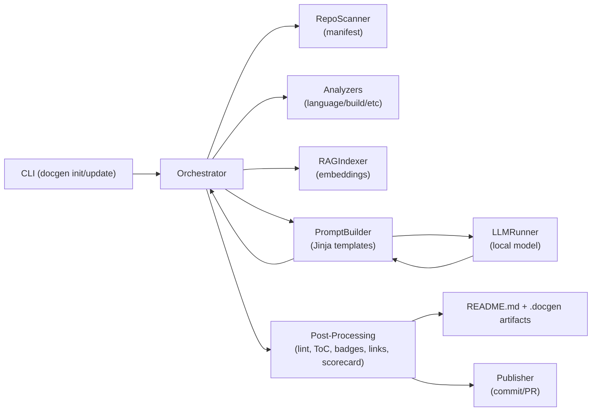
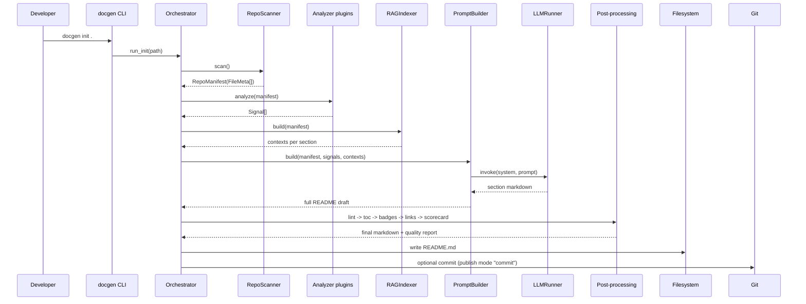
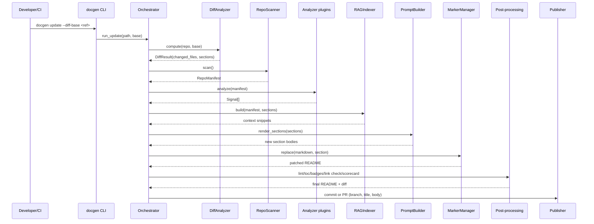
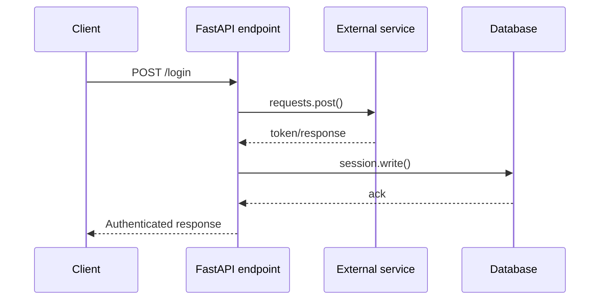

# docgen
<!-- docgen:begin:badges -->
[](#)
[](#)
[](#)
<!-- docgen:end:badges -->

<!-- docgen:begin:toc -->
## Table of Contents
- [Features](#features)
- [Architecture](#architecture)
  - [High-Level Flow](#high-level-flow)
  - [Component Responsibilities](#component-responsibilities)
  - [Artifacts and Data Stores](#artifacts-and-data-stores)
  - [Pipeline Sequence (`docgen init`)](#pipeline-sequence-docgen-init)
  - [Patch Sequence (`docgen update`)](#patch-sequence-docgen-update)
  - [API Signal Extraction](#api-signal-extraction)
- [Quick Start](#quick-start)
- [Configuration](#configuration)
- [Build & Test](#build-test)
- [Deployment](#deployment)
- [Troubleshooting](#troubleshooting)
- [FAQ](#faq)
- [License](#license)
<!-- docgen:end:toc -->

<!-- docgen:begin:intro -->
docgen is a local-first README generator for polyglot repositories. It scans every tracked file, publishes analyzer signals, retrieves grounded context, and guides a local LLM through templated sections to produce or update documentation. This overview reflects a complete pass across `docgen/`, `tests/`, `spec/`, and `docs/` so contributors understand every abstraction before running `docgen init`.
<!-- docgen:end:intro -->

## Features

<!-- docgen:begin:features -->
- **Repository manifest & caching** - `docgen/repo_scanner.py` walks the tree, respects `.gitignore`/`.docgen.yml`, hashes files, and persists `manifest_cache.json` for incremental runs.
- **Analyzer plugin system** - `docgen/analyzers/*` discover language, build, dependency, entrypoint, pattern, and structure signals that describe frameworks, commands, APIs, entities, and repository topology.
- **Template-driven prompting** - `docgen/prompting/builder.py` merges signals with Jinja templates, validates commands, applies style presets, and injects retrieved context per section.
- **Lightweight RAG index** - `docgen/rag/indexer.py`, `embedder.py`, and `store.py` embed README/docs/source excerpts into `.docgen/embeddings.json` for section-scoped retrieval.
- **Local LLM enforcement** - `docgen/llm/runner.py` targets loopback Model Runner or Ollama, blocks remote hosts, and exposes configurable temperature/token limits.
- **Post-processing contract** - `docgen/postproc/*` add badges, rebuild the ToC, lint markdown, validate links, manage markers, and compute scorecards saved to `.docgen/scorecard.json`.
- **Git-aware publishing** - `docgen/git/diff.py` maps changed files to sections while `docgen/git/publisher.py` commits or opens PRs with generated README deltas via the GitHub CLI.
- **Resilient CLI UX** - `docgen/cli.py` and `docgen/failsafe.py` provide verbose logging hooks, dry-run preview support, and fallback stubs when the LLM pipeline cannot complete.
<!-- docgen:end:features -->

## Architecture

<!-- docgen:begin:architecture -->
### High-Level Flow

The orchestrator (`docgen/orchestrator.py`) coordinates the end-to-end pipeline described in `spec/spec.md`, composing scanners, analyzers, prompting, RAG, post-processing, and publishing services.



### Component Responsibilities

| Layer | Key modules | Purpose |
| --- | --- | --- |
| CLI & Logging | `docgen/cli.py`, `docgen/logging.py` | Parses subcommands, wires `--verbose`, and configures namespaced loggers. |
| Configuration | `docgen/config.py` | Parses `.docgen.yml` into `DocGenConfig`, `LLMConfig`, `PublishConfig`, `AnalyzerConfig`, and `CIConfig`, with a handwritten YAML fallback. |
| Repository scanning | `docgen/repo_scanner.py` | Builds `RepoManifest` of `FileMeta` entries, enforces ignore rules, infers file roles, and caches hashes in `.docgen/manifest_cache.json`. |
| Analyzer plugins | `docgen/analyzers/*` | Emit `Signal` objects for languages, frameworks, build tools, dependencies, entrypoints, structural modules, API routes, entities, patterns, and monorepo hints. |
| Prompting | `docgen/prompting/builder.py`, `templates/` | Groups signals, retrieves context, renders section templates, performs command validation, and estimates token budgets. |
| Retrieval (RAG) | `docgen/rag/indexer.py`, `embedder.py`, `store.py`, `constants.py` | Chunks README/docs/source files, computes bag-of-words embeddings, persists context per section, and prunes stale vectors. |
| LLM runtime | `docgen/llm/runner.py` | Chooses HTTP or CLI execution, builds OpenAI-compatible payloads, restricts to loopback hosts, and normalizes responses. |
| Post-processing | `docgen/postproc/*` | Manages markers, regenerates ToC, applies badges, lints markdown, validates links, and records README quality metrics. |
| Git integration | `docgen/git/diff.py`, `docgen/git/publisher.py` | Maps file diffs to affected sections, handles staged changes, and pushes commits or PRs with optional labels. |
| Safety nets | `docgen/failsafe.py` | Generates placeholder sections or full README stubs when prompting fails. |
| Reference material | `spec/spec.md`, `spec/feature_order.md`, `spec/feature_checklist.md`, `docs/ci/*`, `AGENTS.md` | Capture architectural contracts, delivery roadmap, feature status, CI playbooks, and agent guidance. |
| Tests | `tests/` mirroring runtime modules | Pytest suite covering CLI, orchestrator, analyzers, prompting, git workflows, LLM runner stubs, and post-processing helpers. |

### Artifacts and Data Stores

- `.docgen/manifest_cache.json` - cache of file sizes, mtimes, and hashes for fast re-scans.
- `.docgen/embeddings.json` - persisted embedding vectors keyed by section/tag via `EmbeddingStore`.
- `.docgen/scorecard.json` - output of `ReadmeScorecard.evaluate`, tracking coverage, link health, and quick-start quality.
- Git metadata - branches/commits/PRs created by `Publisher` with summaries from `DiffAnalyzer`.
### Pipeline Sequence (`docgen init`)



### Patch Sequence (`docgen update`)



### API Signal Extraction

`StructureAnalyzer` inspects source files for FastAPI decorators, Express route calls, and Pydantic/ORM entities. Each match emits `Signal` metadata such as handler names, HTTP verbs, detected external calls (`requests`, `session`, `db`), and assembled `sequence` steps that downstream templates render as diagrams.



Other analyzers complement these signals:

- `EntryPointAnalyzer` ranks executable commands (FastAPI `uvicorn`, Django `runserver`, npm `dev`, Spring Boot `bootRun`).
- `BuildAnalyzer` pairs manifest files with reproducible build/test commands and OS-aware scripts.
- `DependencyAnalyzer`, `PatternAnalyzer`, and `LanguageAnalyzer` describe frameworks, Docker/K8s/CI layouts, and monorepo hints that feed the features, architecture, and quick-start sections.
- Tests under `tests/analyzers/`, `tests/prompting/`, and `tests/git/` assert signal accuracy, command selection, and publishing behavior.
<!-- docgen:end:architecture -->
## Quick Start

<!-- docgen:begin:quickstart -->
1. Create a virtual environment and activate it:
   - Windows: `python -m venv .venv` then `.\.venv\Scripts\activate`
   - macOS/Linux: `python -m venv .venv` then `source .venv/bin/activate`
2. Install dependencies in editable mode (includes CLI entry point and test tooling):
   ```bash
   python -m pip install --upgrade pip
   python -m pip install -e .[dev]
   ```
3. Configure `.docgen.yml` with local LLM runner details (see Configuration below).
4. Generate an initial README from the repository root:
   ```bash
   python -m docgen.cli init .
   ```
5. After subsequent changes, refresh documentation with:
   ```bash
   python -m docgen.cli update --diff-base origin/main
   ```
6. Use `--dry-run` to preview diffs or `--verbose` for deeper logs while iterating on analyzers.
<!-- docgen:end:quickstart -->

## Configuration

<!-- docgen:begin:configuration -->
`docgen/config.py` loads `.docgen.yml` into strongly typed dataclasses and provides a minimal YAML parser when PyYAML is absent. Common fields:

```yaml
llm:
  runner: "ollama"          # or "model-runner"
  model: "llama3:8b-instruct"
  base_url: "http://localhost:12434/engines/v1"
  temperature: 0.2
  max_tokens: 2048

readme:
  style: "comprehensive"    # or "concise"
  template_pack: null        # optional alt templates under docgen/prompting/templates/

publish:
  mode: "pr"                 # "pr" or "commit"
  branch_prefix: "docgen/readme-update"
  labels: ["docs:auto"]
  update_existing: false

analyzers:
  enabled: []                # subset of plugin names, empty uses all built-ins
  exclude_paths:
    - "sandbox/"

ci:
  watched_globs:
    - "docgen/**"
    - "docs/**"

exclude_paths:
  - "sandbox/"
```

Highlights:

- `LLMConfig` supports env overrides (`DOCGEN_LLM_MODEL`, `DOCGEN_LLM_BASE_URL`, `DOCGEN_LLM_API_KEY`) and enforces loopback URLs.
- `PublishConfig` toggles automatic commits or PR creation; `Publisher` relies on the GitHub CLI when `mode="pr"`.
- `AnalyzerConfig.exclude_paths` removes noisy directories from analysis without editing `.gitignore`.
- Template overrides can live under `docs/templates/` and are picked up automatically when present.
- CI watchers skip updates when changed files do not match `ci.watched_globs`, aligning with the workflow in `docs/ci/docgen-update.yml`.
<!-- docgen:end:configuration -->

## Build & Test

<!-- docgen:begin:build_and_test -->
- Format and lint:
  ```bash
  black docgen tests
  python -m ruff check docgen tests
  ```
- Type-check core modules:
  ```bash
  python -m mypy docgen
  ```
- Run the full test suite (mirrors runtime modules: CLI, orchestrator, analyzers, prompting, git, RAG, post-processing):
  ```bash
  python -m pytest
  ```
- Target specific areas while iterating:
  ```bash
  python -m pytest -k orchestrator
  python -m pytest tests/analyzers/test_structure.py
  ```
- Regenerate README fixtures or inspect scorecards stored under `.docgen/` to validate generated content.
<!-- docgen:end:build_and_test -->
## Deployment

<!-- docgen:begin:deployment -->
- GitHub Actions recipe: `docs/ci/docgen-update.yml` (documented in `docs/ci/github-actions.md`) installs the package in editable mode, runs `docgen update`, and optionally commits README changes back to the branch.
- Self-hosted runners are recommended so the workflow can reach your local inference endpoint (`DOCGEN_LLM_BASE_URL`). The same settings apply when running in CI/CD pipelines outside GitHub.
- `Publisher` can push commits directly (`publish.mode: commit`) for bootstrap scenarios or open PRs with labeled summaries when `gh` CLI credentials are available.
<!-- docgen:end:deployment -->

## Troubleshooting

<!-- docgen:begin:troubleshooting -->
- Use `--verbose` to surface analyzer selection, prompt generation, and post-processing diagnostics emitted by `get_logger("orchestrator")`.
- If the README already exists, `docgen init` will abort; switch to `docgen update` or remove the file before re-initialising.
- Empty or failing sections trigger fallback stubs from `docgen/failsafe.py`; inspect the raised reason and rerun once the underlying analyzer or prompt issue is fixed.
- Link validation issues are logged as warnings. Update relative paths or add missing files before committing generated docs.
- Clear `.docgen/manifest_cache.json` and `.docgen/embeddings.json` when refactoring large parts of the repo structure to force a fresh scan.
- Ensure the local model runner is reachable at a loopback URL; remote hosts are intentionally rejected by `LLMRunner` for security.
<!-- docgen:end:troubleshooting -->

## FAQ

<!-- docgen:begin:faq -->
**Q: How is this README maintained?**
A: Generate with `docgen init` and keep it current via `docgen update` (optionally in CI using the provided workflow).

**Q: What happens if analyzers miss a framework or command?**
A: Signals are pluggable—add a custom analyzer via the `docgen.analyzers` entry-point group or extend the existing utilities under `docgen/analyzers/utils.py`.

**Q: Can docgen use a remote LLM endpoint?**
A: No. `LLMRunner` enforces loopback/`.internal` hosts; supply a local model runner or Ollama instance instead.

**Q: Where do I report issues or propose enhancements?**
A: File an issue or open a discussion in this repository and reference the relevant sections in `spec/spec.md` or `spec/feature_order.md` when describing the change.
<!-- docgen:end:faq -->

## License

<!-- docgen:begin:license -->
Add licensing information once the project selects a license. Track candidate licenses alongside the roadmap in `spec/feature_order.md`.
<!-- docgen:end:license -->